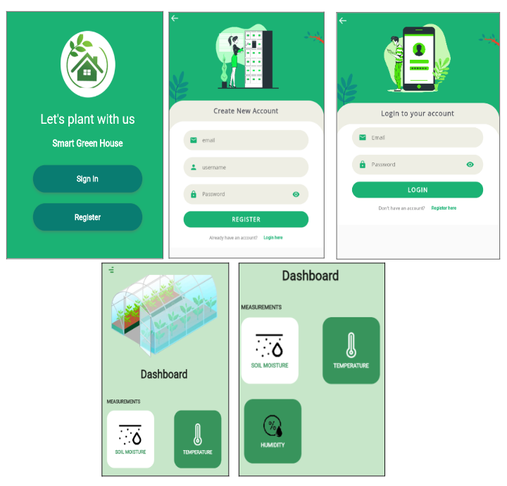

## Projet_Smart_Green_House_CoT

## Context: 
Ce projet est réalisé dans le cadre du module **Cloud of Things** et élaboré par:
- Zeineb Chebaane.
- Rami Zouari.

Avec la tutelle du Dr. Ing. Mohamed-Bécha Kaâniche.

Ce projet est manifesté par une solution intelligente qui est dédiée pour les serres dite "Smart Green House'" permettant de garantir une productivité optimale des cultures à travers la construction d'une serre intelligente créant un climat adapté à la croissance des plantes grâce à l’utilisation de capteurs IoT (capteur d’humidité et de température).

## Guide d'installation :
## Les technologies:
Plusieurs technologies, packages et capteurs ont été utilisés afin de développer notre projet, les technologies sont diverses et utilisées pour le développement backend et frontend.
- Backend:
  - MongoDB
  - MQTT
  - Jakarta EE
  - WildFly 26.1.2 final
- Frontend
  - Flutter
- Serveur
  - Mosquitto Broker
- Hardware
  - Raspberry Pi 4
  - Capteur DHT22
  - Capteur de moisture

## Serveur de déploiement :
Nous avons exploité nos comptes Microsoft gratuits pour nous connecter et obtenir 100 $ offerts par Microsoft Azure. Cela nous a permis de créer une machine virtuelle capable d'héberger le Middleware (i.e. **Jakarta EE**), le Broker MQTT (i.e. **Mosquitto**).Cette machine virtuelle admet les caractéristiques suivantes :
* Ram: 4 GB
* vCPU: 2
* Storage: 30 GB
* La VM est hébergée en Europe de l'Est.

## Certification et classement :

HTTPS a été activé à l'aide du Certbot de Let's Encrypt's, qui nous a permis de vérifier la propriété de notre domaine **www.smart-green-house-cofthings.me** et de sécuriser les connexions à notre site Web. Nous avons également généré les paramètres Dephi-Helman plus forts pour la connexion TLS avec une longueur de 4096 bits. Nous avons pu obtenir la validation **A** de [SSLlabs](https://www.ssllabs.com/) en tant que note globale.

## Captures d'écran de la solution :

## Lectures complémentaires :
Vous pouvez trouver plus d'informations et jeter un œil à la conception de l'architecture avec les documents suivants :
-  [Scope Statement](Docs/ScopeStatement.pdf)
-  [Design Document](Docs/Cahier_Conceptuel.pdf)

